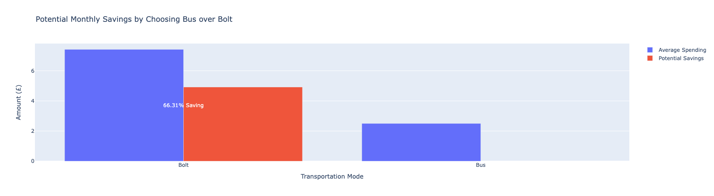
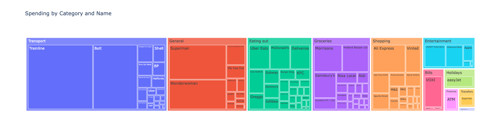
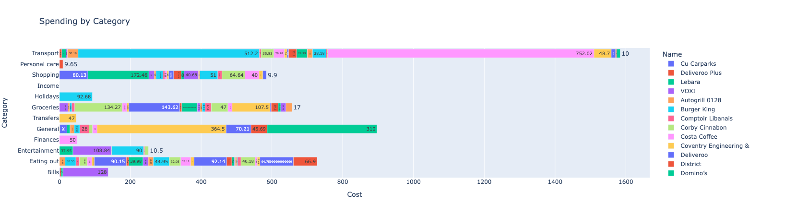
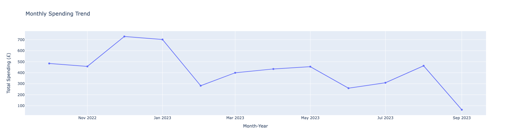
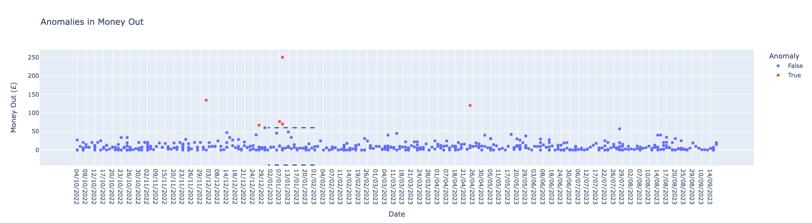

### Bank Statement Analysis - **Achieved 66.31% of potential savings.**

This paper demonstrated the **application** of **data analysis** techniques in **personal finance**, offering **insights** and **recommendations** to optimise budget allocations and improve financial well-being. By **analysing** transaction data, individuals can gain a better understanding of their **financial** behavious, make **informed decisions** and work towards achieving financial stability and independence. The **methodologies** and **insights** presented in this paper can serve as a foundation for **developing** more advanced and personalised **financial** management **tools** and **strategies**.

**Navigating Finances with Data-Driven Insights and Smart Spending**

This study aims to explore personal finance by analysing transaction data from a banking application. The objective is to uncover insights regarding spending  patterns, potential savings opportunities and financial behavious, which could aid in optimising budget allocations and improving financial health. By leveraging **data visualisation**, **statistical analysis** and **machine learning** techniques, the paper reveals **trends**,**anomalies** and provides **recommendations** to **optimise** budget allocations **effectively**. The outcomes of this study have implications for individuals seeking to enhance their financial literacy and manage their finances more efficiently.

## Methodology

The code can be found <a href="https://aeryllvon.github.io/financial_analysis/bank_statement_dataset.ipynb" target="_blank">here</a>
**Data Collection and Pre-processing**

**Data Source** - Personal Bank Statement which was exported to a csv file.

**Data Description**

| Index | Column           | Non-Null Count | Dtype   |
|-------|------------------|----------------|---------|
| 0     | Transaction ID   | 510 non-null   | object  |
| 1     | Date             | 510 non-null   | object  |
| 2     | Time             | 510 non-null   | object  |
| 3     | Type             | 510 non-null   | object  |
| 4     | Name             | 510 non-null   | object  |
| 5     | Emoji            | 421 non-null   | object  |
| 6     | Category         | 510 non-null   | object  |
| 7     | Amount           | 510 non-null   | float64 |
| 8     | Currency         | 510 non-null   | object  |
| 9     | Local amount     | 510 non-null   | float64 |
| 10    | Local currency   | 510 non-null   | object  |
| 11    | Notes and #tags  | 72 non-null    | object  |
| 12    | Address          | 353 non-null   | object  |
| 13    | Receipt          | 0 non-null     | float64 |
| 14    | Description      | 481 non-null   | object  |
| 15    | Category split   | 0 non-null     | float64 |
| 16    | Money Out        | 432 non-null   | float64 |
| 17    | Money In         | 78 non-null    | float64 |

**Data Cleaning** - The dataset was pre-processed to handle **missing values**, **convert data types** and **remove** unncessary **columns**.

**Analysis Performed**

**Spending Breakdown Analysis** 

<a href="https://aeryllvon.github.io/financial_analysis/interactivetreemap.html" target="_blank">

**Category-wise Spending Analysis**

<a href="https://aeryllvon.github.io/financial_analysis/categorybarplot.html" target="_blank">

<a href="https://aeryllvon.github.io/financial_analysis/sunburst.html" target="_blank">

**Time Series of Spending Patterns**

Succinctly **evaluates** and **illustrates** spending **trends** across various categories over time.

<a href="https://aeryllvon.github.io/financial_analysis/line.html" target="_blank">

**Anomaly Detection**

Employed **statistical** methods to identify unusual or suspicious transactions.

<a href="https://aeryllvon.github.io/financial_analysis/anomalies.html" target="_blank">

**Discussion**

The insights derived from this analysis offer valuable information for individuals looking to optimise their budget and improve financial literacy. Understanding spending trends, identifying major spending categories and recognising potential savings opportunities enables more informed financial decision-making. However, personal finance management is a complex and individual-centric domain and what works for one may not work for others. A more personalised and adaptive approach, considering individual preferences, financial goals and risk tolerance, can lead to more effeective budgeting and financial management strategies.

